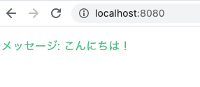

# 環境構築

## セットアップ手順

前提：npmなどの開発環境なし

```
# nvmインストール
curl -o- https://raw.githubusercontent.com/nvm-sh/nvm/v0.37.0/install.sh | bash

# パス設定
% cat ~/.zshrc 
export NVM_DIR="$HOME/.nvm"
[ -s "$NVM_DIR/nvm.sh" ] && \. "$NVM_DIR/nvm.sh"  # This loads nvm

# nvmバージョン確認
nvm ls-remote
       v14.15.4   (LTS: Fermium)
       v14.15.5   (LTS: Fermium)
       v14.16.0   (LTS: Fermium)
       v14.16.1   (LTS: Fermium)
       v14.17.0   (LTS: Fermium)
->     v14.17.1   (Latest LTS: Fermium)
        v15.0.0
        v15.0.1
        v15.1.0

# node.js(LTS)インストール
nvm install v14.17.1

# Vueインストール
npm install vue@next
この時点だとまだvue --versionは使えない

npm install -g @vue/cli

vue --version
@vue/cli 4.5.13

vue upgrade --next
package.jsonがないと怒られるので、npm initしてデフォルト回答する

vue upgrade --next
 WARN  There are uncommitted changes in the current repository, it's recommended to commit or stash them first.
? Still proceed? Yes
✔  Gathering package information...
 DONE  Seems all plugins are up to date. Good work!

 npm i -g @vue/cli-service-global
 npm i @vue/compiler-sfc
```


## 参考サイト

- https://qiita.com/tanishi/items/f741e4bebfb6b6d470dc
- https://qiita.com/tanaka-lapis-jp/items/2039570c8d05824665da
- https://v3.ja.vuejs.org/guide/installation.html#npm

# Vue CLI利用

## Vue 3使ったらダメだった

```
vue create tutorial


Vue CLI v4.5.13
? Please pick a preset: Default (Vue 3) ([Vue 3] babel, eslint)


Vue CLI v4.5.13
✨  Creating project in /Users/yuta/repo/vuelocalportal/tutorial.
⚙️  Installing CLI plugins. This might take a while...


> fsevents@1.2.13 install /Users/yuta/repo/vuelocalportal/tutorial/node_modules/watchpack-chokidar2/node_modules/fsevents
> node install.js

No receipt for 'com.apple.pkg.CLTools_Executables' found at '/'.

No receipt for 'com.apple.pkg.DeveloperToolsCLILeo' found at '/'.

No receipt for 'com.apple.pkg.DeveloperToolsCLI' found at '/'.

gyp: No Xcode or CLT version detected!
gyp ERR! configure error 
gyp ERR! stack Error: `gyp` failed with exit code: 1
gyp ERR! stack     at ChildProcess.onCpExit (/Users/yuta/.nvm/versions/node/v14.17.1/lib/node_modules/npm/node_modules/node-gyp/lib/configure.js:351:16)
gyp ERR! stack     at ChildProcess.emit (events.js:375:28)
gyp ERR! stack     at Process.ChildProcess._handle.onexit (internal/child_process.js:277:12)
gyp ERR! System Darwin 20.5.0
gyp ERR! command "/Users/yuta/.nvm/versions/node/v14.17.1/bin/node" "/Users/yuta/.nvm/versions/node/v14.17.1/lib/node_modules/npm/node_modules/node-gyp/bin/node-gyp.js" "rebuild"
gyp ERR! cwd /Users/yuta/repo/vuelocalportal/tutorial/node_modules/watchpack-chokidar2/node_modules/fsevents
gyp ERR! node -v v14.17.1
gyp ERR! node-gyp -v v5.1.0
gyp ERR! not ok 

> fsevents@1.2.13 install /Users/yuta/repo/vuelocalportal/tutorial/node_modules/webpack-dev-server/node_modules/fsevents
> node install.js

No receipt for 'com.apple.pkg.CLTools_Executables' found at '/'.

No receipt for 'com.apple.pkg.DeveloperToolsCLILeo' found at '/'.

No receipt for 'com.apple.pkg.DeveloperToolsCLI' found at '/'.

gyp: No Xcode or CLT version detected!
gyp ERR! configure error 
gyp ERR! stack Error: `gyp` failed with exit code: 1
gyp ERR! stack     at ChildProcess.onCpExit (/Users/yuta/.nvm/versions/node/v14.17.1/lib/node_modules/npm/node_modules/node-gyp/lib/configure.js:351:16)
gyp ERR! stack     at ChildProcess.emit (events.js:375:28)
gyp ERR! stack     at Process.ChildProcess._handle.onexit (internal/child_process.js:277:12)
gyp ERR! System Darwin 20.5.0
gyp ERR! command "/Users/yuta/.nvm/versions/node/v14.17.1/bin/node" "/Users/yuta/.nvm/versions/node/v14.17.1/lib/node_modules/npm/node_modules/node-gyp/bin/node-gyp.js" "rebuild"
gyp ERR! cwd /Users/yuta/repo/vuelocalportal/tutorial/node_modules/webpack-dev-server/node_modules/fsevents
gyp ERR! node -v v14.17.1
gyp ERR! node-gyp -v v5.1.0
gyp ERR! not ok 

> yorkie@2.0.0 install /Users/yuta/repo/vuelocalportal/tutorial/node_modules/yorkie
> node bin/install.js

setting up Git hooks
can't find .git directory, skipping Git hooks installation

> core-js@3.15.1 postinstall /Users/yuta/repo/vuelocalportal/tutorial/node_modules/core-js
> node -e "try{require('./postinstall')}catch(e){}"


> ejs@2.7.4 postinstall /Users/yuta/repo/vuelocalportal/tutorial/node_modules/ejs
> node ./postinstall.js

added 1261 packages from 665 contributors and audited 1261 packages in 13.694s

78 packages are looking for funding
  run `npm fund` for details

found 14 vulnerabilities (7 moderate, 7 high)
  run `npm audit fix` to fix them, or `npm audit` for details
🚀  Invoking generators...
📦  Installing additional dependencies...

added 83 packages from 87 contributors and audited 1344 packages in 3.094s

85 packages are looking for funding
  run `npm fund` for details

found 14 vulnerabilities (7 moderate, 7 high)
  run `npm audit fix` to fix them, or `npm audit` for details
⚓  Running completion hooks...

📄  Generating README.md...

🎉  Successfully created project tutorial.
👉  Get started with the following commands:

 $ cd tutorial
 $ npm run serve
```

## Vue2でやる

```
# コンパイル
vue create tutorial2


Vue CLI v4.5.13
? Please pick a preset: Default ([Vue 2] babel, eslint)

# 実行
  vue serve hello.vue --open
There's a package.json in the current directory.
Did you mean npm run serve?
 INFO  Starting development server...
98% after emitting CopyPlugin

 DONE  Compiled successfully in 1042ms                                                                                                              13:29:37


  App running at:
  - Local:   http://localhost:8080/ 
  - Network: http://192.168.0.41:8080/

  Note that the development build is not optimized.
  To create a production build, run npm run build.
```

### 動作確認

